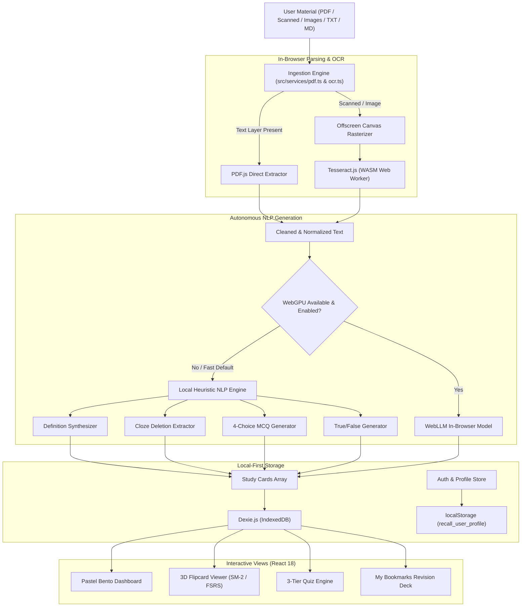

# Recall 🧠 — Intelligent Client-Side Study & Mastery App

<div align="center">

[](https://recall-xi-three.vercel.app)
[](https://github.com/divyani-22/ieee)
[](https://react.dev)
[](https://www.typescriptlang.org)
[](https://vitejs.dev)
[](https://tailwindcss.com)
[](https://github.com/divyani-22/ieee)
[](LICENSE)

<br />

**Turn any lecture document, scanned PDF, or notes into interactive 3D flipcards and adaptive quizzes.**  
*100% In-Browser • Zero Backend • Offline-First • No API Keys Required*

[**Explore Live Demo »**](https://recall-xi-three.vercel.app) · [Report Bug](https://github.com/divyani-22/ieee/issues) · [Request Feature](https://github.com/divyani-22/ieee/issues)

</div>

---

## 📖 Table of Contents
- [Overview](#-overview)
- [✨ Key Features](#-key-features)
- [🎨 Design Aesthetic](#-design-aesthetic)
- [🏗 System Architecture](#-system-architecture)
- [🧠 Generation & Spaced Repetition Engines](#-generation--spaced-repetition-engines)
- [🔐 Authentication & Personalization](#-authentication--personalization)
- [🛠 Tech Stack](#-tech-stack)
- [🚀 Quick Start](#-quick-start)
- [🧪 Testing & Quality Assurance](#-testing--quality-assurance)
- [🚢 Production Deployment](#-production-deployment)
- [⌨️ Keyboard Shortcuts](#️-keyboard-shortcuts)
- [📄 License & Authors](#-license--authors)

---

## 🌟 Overview

**Recall** is an intelligent, privacy-first study companion designed for students, researchers, and lifelong learners. Traditional study apps lock your notes behind paywalled APIs, subscriptions, and invasive telemetry. Recall changes the paradigm by operating **entirely client-side**:

1. **Ingest Anything**: Upload digital lecture PDFs, scanned course packs, raw markdown, or textbook snapshots.
2. **Hybrid OCR & Extraction**: Direct `pdfjs-dist` text stream parsing with automatic fallback to client-side `Tesseract.js` Web Workers when scanned images are detected.
3. **Instant Study Card Generation**: Rule-based syntactic NLP and optional in-browser WebGPU WebLLM synthesize 4 distinct card archetypes (Definitions, Cloze Deletions, 4-Option MCQs, True/False statements).
4. **Master Concepts with 3D Flipcards & Quizzes**: Spaced repetition (SuperMemo SM-2 / FSRS hybrid) coupled with a targeted multi-difficulty quiz module and bookmarked concept drilling.

---

## ✨ Key Features

### 🎴 3D Flippable Flashcards
- **Realistic 3D Card Physics**: Built with CSS 3D transforms (`preserve-3d`, `rotateY(180deg)`) and smooth animations powered by Framer Motion.
- **Always Visible Answers & Definitions**: Generous card proportions and dedicated scroll containers ensure long explanations and definitions are never clipped.
- **Dynamic Pastel Rotation**: Cards cycle across tactile pastel hues (*Mint, Lavender, Butter Yellow, Periwinkle, Soft Peach, Soft Pink*) with circular icons, question difficulty badges, and card progress counters (`Q 3/10`).
- **Interactive Rating Actions**: Quick 4-tier ratings (`Again`, `Hard`, `Good`, `Easy`) and bookmarking (*"I Don't Remember"*) for targeted revision.

### 🎯 Adaptive Quiz System
- **3 Difficulty Tiers**: Simple (core definitions & true/false), Intermediate (balanced conceptual mix), and Hard (distractor-heavy MCQs & cloze eliminations).
- **Instant Explanations**: Review question rationale and view the original lecture context sentence that inspired the question.
- **Session Review**: Track accuracy percentage, answer streaks, duration, and identify weak topics for focused review.

### 📄 Ingestion & Hybrid OCR
- **PDF Extraction**: Fast parsing of digital text layers via `pdfjs-dist`.
- **On-Device Scanned OCR**: Automatically detects scanned/image-only pages, rasterizes them onto an offscreen HTML5 canvas, and runs `Tesseract.js` in a WebAssembly Web Worker without locking the UI.
- **Supported Formats**: `.pdf`, `.png`, `.jpg`, `.jpeg`, `.webp`, `.txt`, `.md`.
- **Text Cleaner**: Re-joins hyphenated line breaks, normalizes Unicode quotes, and filters out noise.

### 🔖 "My Bookmarks" Concept Hub
- Cards flagged with *"I Don't Remember"* during review sessions are automatically saved with timestamps.
- One-click **"Review All Bookmarks"** launches a focused study deck to help eliminate blind spots before exams.

### 💾 Local-First Persistence & Portability
- **Dexie.js IndexedDB**: High-speed, offline-first client storage for decks, cards, study logs, and user settings.
- **Anki-Compatible Export/Import**: Export decks to standard Anki CSV (Front, Back, Tags) or import existing decks.
- **Full JSON Backups**: One-click complete database export and restore.

---

## 🎨 Design Aesthetic

Recall features a **"Soft Pastel Learning App"** aesthetic designed to feel airy, calm, and distraction-free:

- **Color Palette**:
  - `Mint`: `#D6EAE1`
  - `Lavender`: `#D9CDEE`
  - `Butter Yellow`: `#FCE6A6`
  - `Periwinkle`: `#CFD3F0`
  - `Soft Peach`: `#F9D9CF`
  - `Dark Charcoal Typography`: `#16161D`
- **Pillowy Surfaces**: Large rounded corners (`rounded-3xl`, `rounded-4xl`), subtle layered shadows (`shadow-pillowy`), and pill-shaped action buttons.
- **Ambient Lighting**: Subtle background grid canvas with delicate corner radial glows that adapt gracefully between Light and Dark mode.

---

## 🏗 System Architecture



---

## 🧠 Generation & Spaced Repetition Engines

### Syntactic Rule-Based NLP Pipeline
- **Definition Detection**: Uses regular expressions and syntactic patterns (`X is defined as Y`, `X refers to Y`, `X denotes Y`) to generate high-value definition cards.
- **TF-IDF & Cloze Extraction**: Computes term frequency against stop-word lexicons to isolate core terminology into `{{cloze}}` deletions.
- **Semantic MCQ Distractor Generation**: Pulls grammatically aligned terms from within the same document to ensure challenging, non-repeating distractor options.
- **Counter-Factual Statements**: Synthesizes verified True/False challenges with reference citations to the original source passage.

### Spaced Repetition Scheduling (SM-2 / FSRS Hybrid)
Each flashcard tracks review repetitions, easiness factor, interval, and next due date:
- **Again (1)**: Interval resets to 1 day; ease decreases by 0.20.
- **Hard (2)**: Interval scales by 1.20×; ease decreases by 0.15.
- **Good (3)**: Normal progression ($I_1 = 1$, $I_2 = 4$, $I_n = I_{n-1} \times \text{ease}$).
- **Easy (4)**: Accelerated leap ($I_1 = 3$, $I_2 = 7$, $I_n = I_{n-1} \times \text{ease} \times 1.35$); ease increases by 0.15.

---

## 🔐 Authentication & Personalization

Recall includes a friendly authentication system that allows users to personalize their learning experience while maintaining complete privacy:

- **Google Sign-In**: Quick simulated OAuth flow prompting for the user's name and email.
- **Phone Number Authentication**:
  - Country code selector (`+1`, `+44`, `+91`, `+61`, `+49`, `+33`, `+81`).
  - Mobile number input and name onboarding prompt (*"What should we call you?"*).
  - 6-digit OTP verification screen.
- **Personalized Experience**:
  - Dynamic Bento dashboard greeting (`Hello, {name}!`).
  - Active user pill in the top navigation with session status.
  - Profile settings modal with inline name editing and log out.

---

## 🛠 Tech Stack

| Domain | Technology / Library |
|---|---|
| **Frontend Framework** | [React 18.3](https://react.dev) with [TypeScript 5.5](https://www.typescriptlang.org) |
| **Build Tool & Bundler** | [Vite 5.4](https://vitejs.dev) |
| **Styling & Icons** | [Tailwind CSS 3.4](https://tailwindcss.com), [Lucide React](https://lucide.dev) |
| **Animations & Confetti** | [Framer Motion](https://www.framer.com/motion/), [canvas-confetti](https://www.npmjs.com/package/canvas-confetti) |
| **Local Database** | [Dexie.js 4](https://dexie.org) (IndexedDB wrapper) & `dexie-react-hooks` |
| **Document Parsing & OCR** | `pdfjs-dist 4.4`, `tesseract.js 6.0` (Web Workers / WASM) |
| **Local AI Acceleration** | [@mlc-ai/web-llm](https://webllm.mlc.ai/) (optional WebGPU) |
| **Testing Engine** | Node.js built-in test runner (`node:test`, `node:assert`) |
| **Deployment** | [Vercel](https://vercel.com) (Static SPA, zero edge/serverless compute costs) |

---

## 🚀 Quick Start

### Prerequisites
- **Node.js**: `v18.0.0` or higher (tested on `v24.15.0`)
- **npm**: `v9.0.0` or higher

### Installation

1. **Clone the repository**:
   ```bash
   git clone https://github.com/divyani-22/ieee.git
   cd ieee
   ```

2. **Install project dependencies**:
   ```bash
   npm install
   ```

3. **Start local development server**:
   ```bash
   npm run dev
   ```
   Open [http://localhost:5173](http://localhost:5173) in your browser.

4. **Build for production**:
   ```bash
   npm run build
   ```
   The production-ready assets will be generated in `dist/`.

---

## 🧪 Testing & Quality Assurance

Recall includes an automated regression test suite covering text parsing, OCR normalization, spaced repetition scheduling, Anki export/import, authentication validation, and 3D card layout rendering.

Run the test suite:
```bash
npm test
```

### Verified Test Cases:
```
✔ cleanExtractedText rejoins hyphenated line breaks and normalizes unicode
✔ calculateNextReview produces correct intervals and ease adjustments
✔ Definition extractor detects "X is defined as Y" and "X refers to Y"
✔ Anki CSV and JSON serialization & deserialization
✔ Quiz difficulty selection partitions questions appropriately
✔ I Don't Remember marks card as bookmarked with timestamp and enables review
✔ Fallback generator yields valid study cards when text lacks strict definition patterns
✔ MCQ generation produces unique options without duplicate distractors
✔ Flashcard styling enforces non-zero height for CSS 3D preserve-3d context
✔ Spaced repetition increases interval monotonically across consecutive Good reviews
✔ User profile creation enforces name requirement for both Google and Phone auth

11 tests passed | 0 failed
```

---

## 🚢 Production Deployment

Recall is a 100% static single-page application. It requires **no server**, **no container**, and **no secret environment variables**.

### Deploy via Vercel CLI
```bash
npm install -g vercel
vercel --prod
```

### Deploy via Vercel Web Dashboard
1. Fork or push this repository to your GitHub account.
2. In the [Vercel Dashboard](https://vercel.com), select **Add New Project** and choose this repository.
3. Keep default settings:
   - **Framework Preset**: `Vite`
   - **Build Command**: `npm run build`
   - **Output Directory**: `dist`
4. Click **Deploy**. Your app will be live globally on Vercel's edge network within 60 seconds!

---

## ⌨️ Keyboard Shortcuts

| Shortcut | Action |
|---|---|
| <kbd>Space</kbd> or <kbd>Enter</kbd> | Flip Active Flashcard |
| <kbd>1</kbd> | Rate Card: **Again** |
| <kbd>2</kbd> | Rate Card: **Hard** |
| <kbd>3</kbd> | Rate Card: **Good** |
| <kbd>4</kbd> | Rate Card: **Easy** |
| <kbd>B</kbd> | Toggle *"I Don't Remember"* (Bookmark) |
| <kbd>?</kbd> | Toggle Keyboard Shortcuts Modal |

---

## 📄 License & Authors

Distributed under the **MIT License**. See `LICENSE` for more information.

- **Author**: [Divyani Sharma](https://github.com/divyani-22)
- **Repository**: [divyani-22/ieee](https://github.com/divyani-22/ieee)
- **Live Demo**: [recall-xi-three.vercel.app](https://recall-xi-three.vercel.app)

---

<div align="center">
  <sub>Built with ❤️ for learners everywhere • 100% Client-Side & Open Source</sub>
</div>
